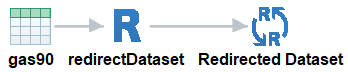
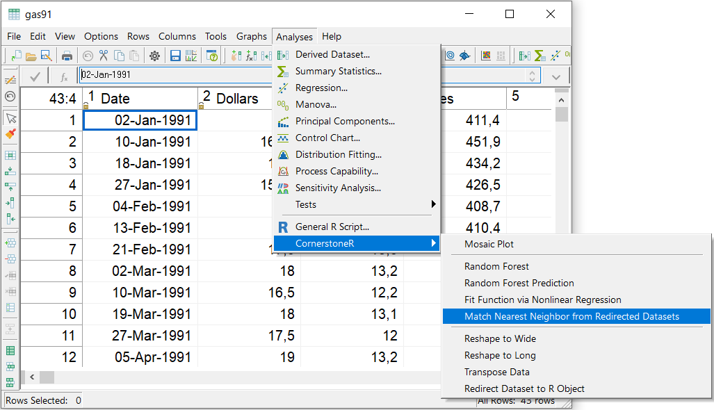
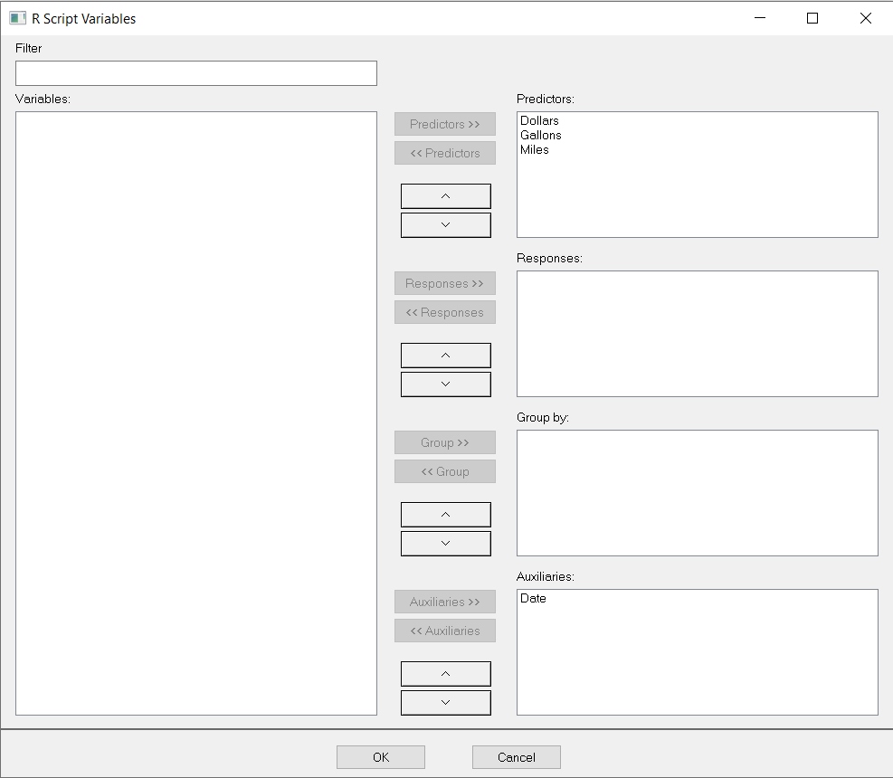
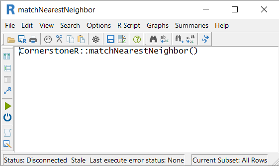
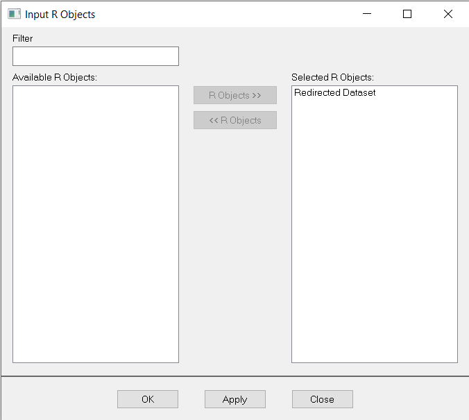
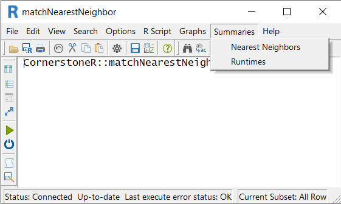
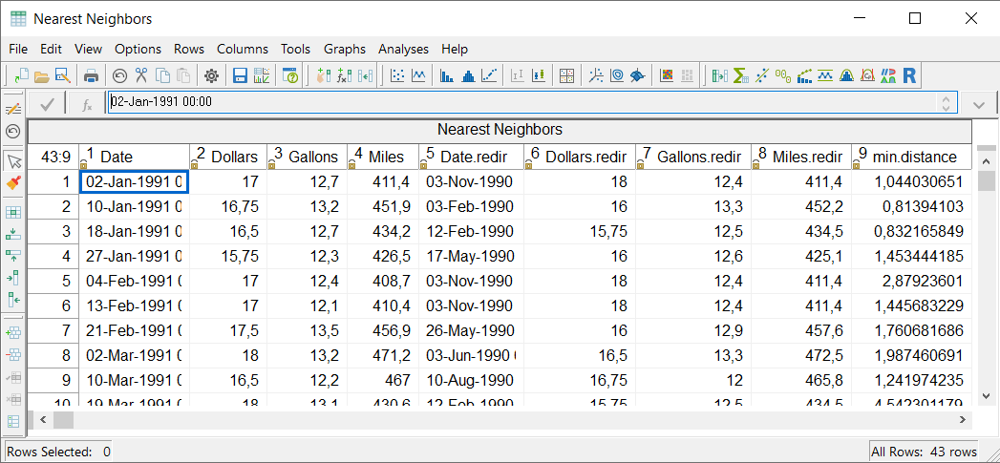
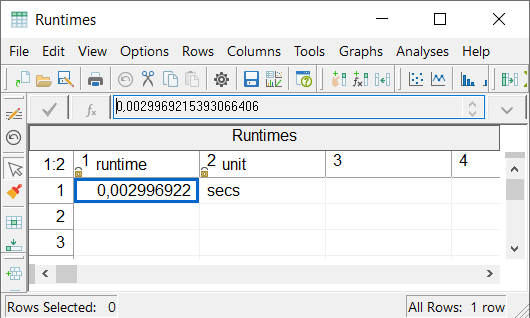
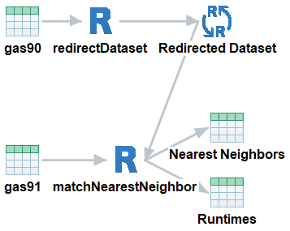

```{r setup, include = FALSE}
# show grouped code output instead of single lines
# use '#>' for R outputs
knitr::opts_chunk$set(collapse = TRUE, comment = "#>")
```


# Initial Situation and Goal

Assume, you have two datasets A and B and want to know which observation in A is the nearest one to
each observation in B. You have to calculate the distance between each observation in B to every
observation in A. This calculation results in a dataset with the same number of observations as in
dataset B.

As an example we use the two 'Cornerstone' datasets 'gas90' and 'gas91' with the goal to get the
matching observation from 'gas90' to each observation in 'gas91'.

How do we perform this calculation in 'Cornerstone' via 'matchNearestNeighbor' from 'CornerstoneR'?


# Cornerstone Workflow

As a preparation we have to redirect dataset 'gas90' to an 'R' object with the result shown in the
following screenshot. For details on redirecting a dataset please consider the help for
'Redirect Dataset to R Object'.

```{r matchNeighborRedirect, echo=FALSE, fig.cap="Match Nearest Neighbor: Redirect Dataset"}

```

In this example we redirect the variables 'Dollar', 'Gallons', and 'Miles' as predictors and use
'Date' as auxiliary variable.

Now we open the dataset 'gas91' in 'Cornerstone' and choose menu 'Analysis' -> 'CornerstoneR' ->
'Match Nearest Neighbor from Redirected Datasets' as shown in the following screenshot.

```{r matchNeighborMenu, echo=FALSE, fig.cap="Match Nearest Neighbor: Menu"}

```

In the appearing dialog, see next screenshot, select 'Dollar', 'Gallons', and 'Miles' as
predictors. 'Date' is the auxiliary variable. As you can see, the redirected dataset should match
to the current dataset in a form that the corresponding variables are named equally.

```{r matchNeighborVariables, echo=FALSE, fig.cap="Match Nearest Neighbor: Variable Selection"}

```

'OK' confirms your selection and the following window appears.

```{r matchNeighborRScript, echo=FALSE, fig.cap="Match Nearest Neighbor: R Script"}

```

At this point we add the redirected dataset to the matching nearest neighbor dialog at hand. It is
possible via menu 'R Script' -> 'Input R Objects' which brings up the following dialog.

```{r matchNeighborInputRObj, echo=FALSE, fig.cap="Match Nearest Neighbor: Input R Objects"}

```

We choose 'Redirected Dataset' as selected 'R' objects and click 'OK'. It is possible to select
multiple redirected datasets for the calculation. In this case the algorithm searches for each
observation its nearest neighbor from each redirected dataset independently.

Now, click the execute button (green arrow) or choose the menu 'R Script' -> 'Execute' and
all calculations are done via 'R'. Calculations are done if the text at the lower left status
bar contains 'Last execute error state: OK'. Our result is available via the 'Summaries' menu
as shown in the following screenshot.

```{r matchNeighborResultMenu, echo=FALSE, fig.cap="Match Nearest Neighbor: Result Menu"}

```

We get the resulting dataset via 'Summaries' -> 'Nearest Neighbors' as shown in the following
screenshot.

```{r matchNeighborNearestDataset, echo=FALSE, fig.cap="Match Nearest Neighbor: Result Dataset"}

```

The first four columns represent the original observations from 'gas91'. The following four columns
show the selected observation from dataset 'gas90' with is nearest considering Euclidean distance in
the last column 'min.distance'. Due to the fact that we choose 'Date' as auxiliary variable the
distance is calculated based on the three selected predictor variables. In the multiple case we
get additional columns for each redirected dataset.

Additionally, we get the runtime of this 'R' script via 'Summaries' -> 'Runtimes' as shown in the
following screenshot.

```{r matchNeighborRuntimes, echo=FALSE, fig.cap="Match Nearest Neighbor: Runtimes"}

```

This measurement helps to estimate calculation time for a growing dataset.

Finally, the 'Cornerstone' workmap with all generated objects looks like the following screenshot.

```{r matchNeighborWorkmap, echo=FALSE, fig.cap="Match Nearest Neighbor: Final Workmap"}

```
