```{r setup, include = FALSE}
# show grouped code output instead of single lines
# use '#>' for R outputs
knitr::opts_chunk$set(collapse = TRUE, comment = "#>")
```


# Initial Situation and Goal

In addition to the 'Cornerstone' core methods of fitting data by a linear regression or perform a
MANOVA it is possible to use a random forest to model data. Afterwards, the model can be used to
make predictions for other datasets.

How do we use the method 'RandomForest' in 'Cornerstone' from 'CornerstoneR'?


# Fit Random Forest to Data

To use a random forest model in 'Cornerstone' open a dataset, e.g. 'irisdata' and choose menu 
'Analysis' -> 'CornerstoneR' -> 'Random Forest' as shown in the following screenshot.

```{r randomForestMenu, echo=FALSE, fig.cap="Random Forest: Menu"}
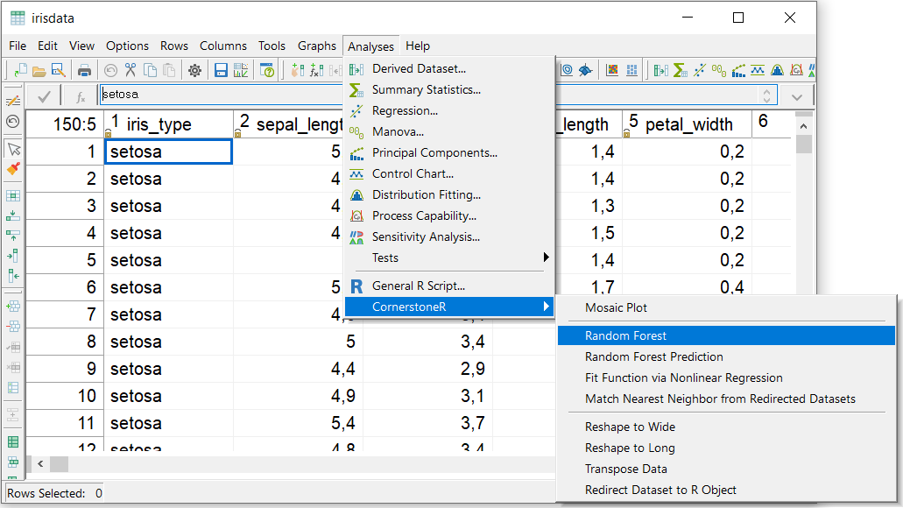
```

In the appearing dialog select all 'sepal_\*' and 'petal_\*' variables to predictors. 'iris_type' is
the response variable. It is also possible to select multiple responses to fit multiple random
forest models at once.

```{r randomForestVariables, echo=FALSE, fig.cap="Random Forest: Variable Selection"}
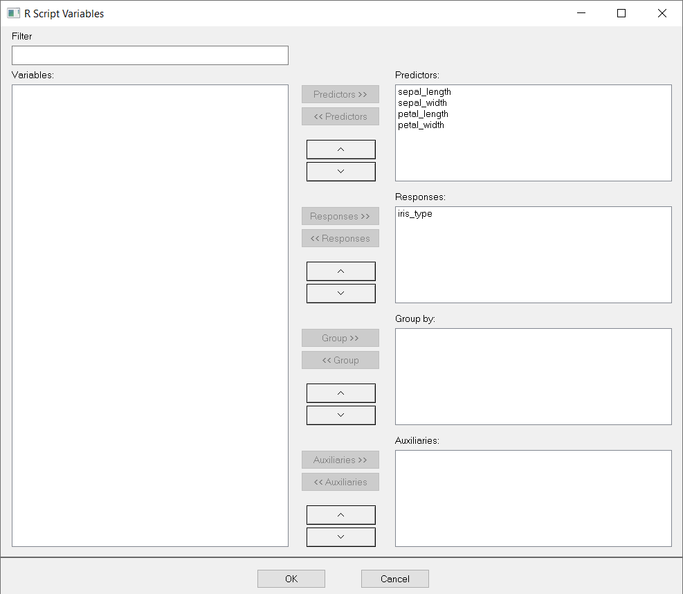
```

'OK' confirms your selection and the following window appears.

```{r randomForestRScript, echo=FALSE, fig.cap="Random Forest: R Script"}
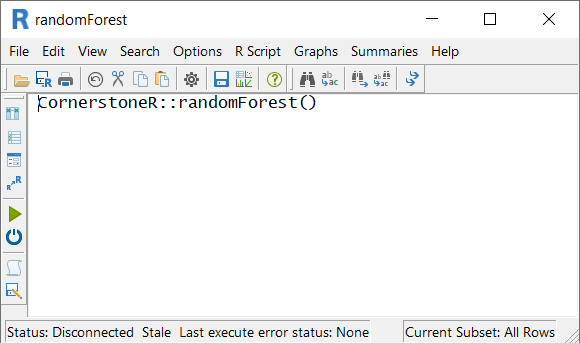
```

Now, click the execute button (green arrow) or choose the menu 'R Script' -> 'Execute' and
all calculations are done via 'R'. Calculations are done if the text at the lower left status
bar contains 'Last execute error state: OK'. Our result is available via the 'Summaries' menu
as shown in the following screenshot.

```{r randomForestResultMenu, echo=FALSE, fig.cap="Random Forest: Result Menu"}
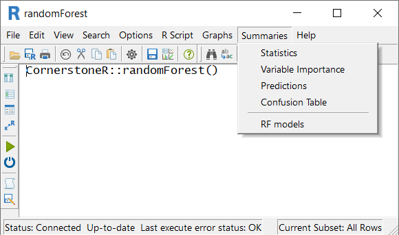
```


## Statistics

Via 'Summaries' -> 'Statistics' the following dataset with some essential statistics is shown.
When you selected multiple response variables these statistics are shown row-wise for each variable.

```{r randomForestStatisticsDataset, echo=FALSE, fig.cap="Random Forest: Statistics Dataset"}
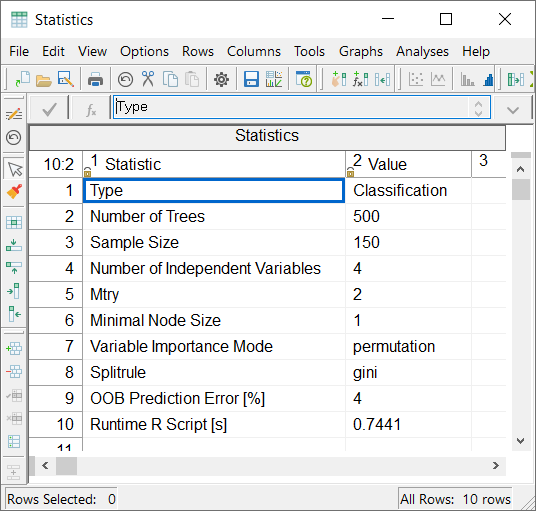
```

For instance, the 'Type' shows whether the random forest used a classification or regression model.
The 'Sample Size' let you check on how many observations the model learns.
To estimate the calculation time for bigger data 'Runtime R Script [s]' shows the corresponding
time 'R' needed.


## Variable Importance

Via 'Summaries' -> 'Variable Importance' the following dataset is shown. For multiple responses
the variable importance is shown row-wise for each variable.

```{r randomForestVariableImportance, echo=FALSE, fig.cap="Random Forest: Variable Importance"}
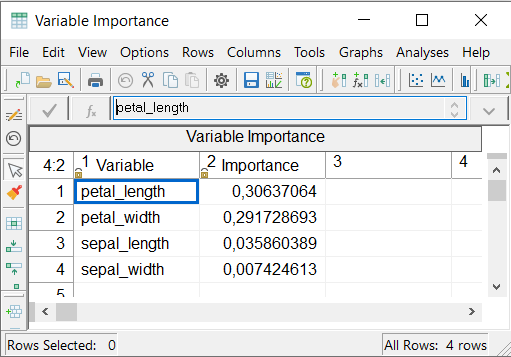
```


## Predictions

Via 'Summaries' -> 'Predictions' the following dataset is shown. Each additional response variable
gets four additional columns with its corresponding data.

```{r randomForestPredictions, echo=FALSE, fig.cap="Random Forest: Predictions"}
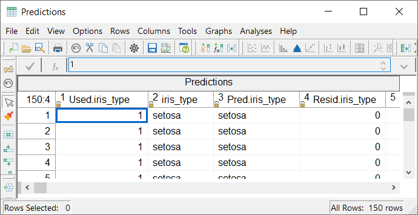
```

The first column 'Used.iris_type' indicates whether this observation was used (1) or not (0) to fit
the random forest model. You find the original data in column 'iris_type'. The corresponding
prediction by the model is shown in column 'Pred.iris_type'. 'Resid.iris_type', as the fourth
column, shows the calculated residuum. For classification models it is 0 (matching prediction) or
1 (not matching prediction). In case of regression models we calculate the difference between 
observation and prediction.

If a response is not observed the model predicts automatically its value. To demonstrate this case
I manually deleted the second observation. The result is shown in the following screenshot.

```{r randomForestMissingResp, echo=FALSE, fig.cap="Random Forest: Missing Response Observation"}
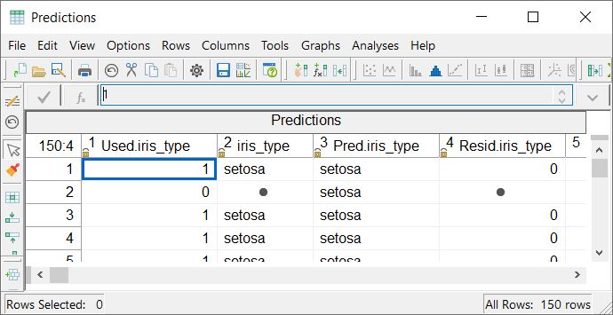
```

Now this row isn't used to fit the model ('Used.iris_type' = 0), its observation is missing as
expected, the observation is predicted as 'setosa' in column 'Pred.iris_type', and it is not
possible to calculate a residuum.


## Confusion Table

Confusion tables are only calculated for classification models and available via 'Summaries' ->
'Confusion Table'. For multiple response variables an additional menu we add an additional menu
for each classification.

```{r randomForestConfusionTable, echo=FALSE, fig.cap="Random Forest: Confusion Table"}
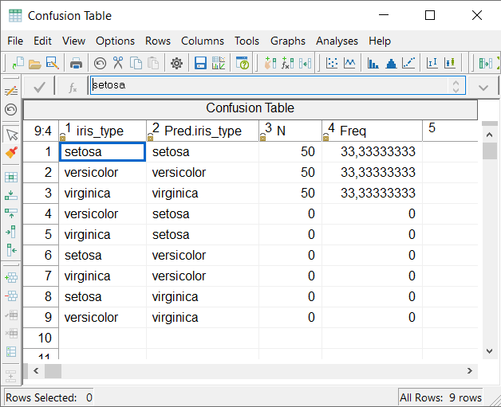
```

The table shows for each level the number of corresponding predictions. For the 'irisdata' dataset
all predictions match to their observations. For example, no 'setosa' was predicted as 'versicolor'
which is listed in line 6.


## RF Models

All models in the 'Cornerstone' object 'randomForest' can be exported to the workmap via
'Summaries' -> 'RF Models'.

```{r randomForestRFmodels, echo=FALSE, fig.cap="Random Forest: RF Models"}
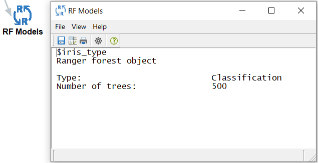
```

We need this export to use existing random forest models in additional datasets for predictions.


# Use Fitted Random Forest for Predictions

In this section we discuss prediction of a response in a new dataset with the existing model from
above. Therefore, we open the dataset 'irisdata' in 'Cornerstone' again and delete the column 
'iris_type'. Starting form this dataset we want to predict the original response 'iris_type'.
Via menu 'Analyses' -> 'CornerstoneR' -> 'Random Forest Prediction' as shown in the following
screenshot.

```{r randomForestPredMenu, echo=FALSE, fig.cap="Random Forest Prediction: Menu"}
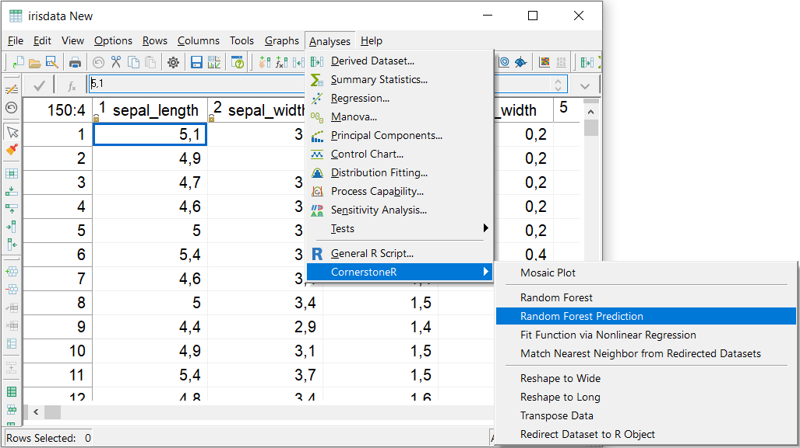
```

In the appearing dialog select all 'sepal_\*' and 'petal_\*' variables to predictors. We have no
response variable.

```{r randomForestPredVariables, echo=FALSE, fig.cap="Random Forest Prediction: Variable Selection"}

```

'OK' confirms your selection and the following window appears.

```{r randomForestPredRScript, echo=FALSE, fig.cap="Random Forest Prediction: R Script"}
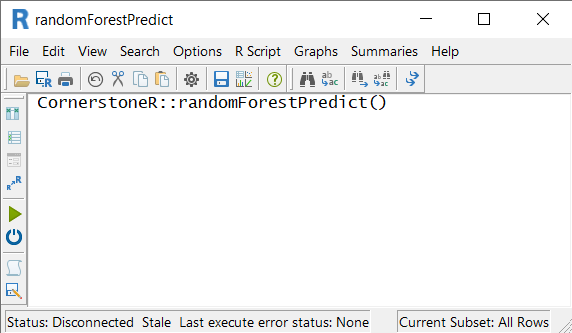
```

At this point we add the existing random forest model to the prediction dialog at hand. It is
possible via menu 'R Script' -> 'Input R Objects' which brings up the following dialog.

```{r randomForestPredInputRObj, echo=FALSE, fig.cap="Random Forest Prediction: Input R Objects"}
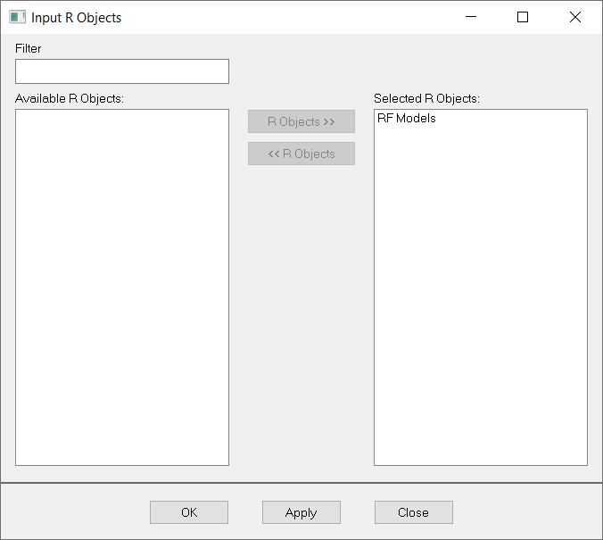
```

We choose 'RF Models' as selected 'R' objects and click 'OK'.

Now, click the execute button (green arrow) or choose the menu 'R Script' -> 'Execute' and
all calculations are done via 'R'. Calculations are done if the text at the lower left status
bar contains 'Last execute error state: OK'. Our result is available via the 'Summaries' menu
as shown in the following screenshot.

```{r randomForestPredResultMenu, echo=FALSE, fig.cap="Random Forest Prediction: Result Menu"}
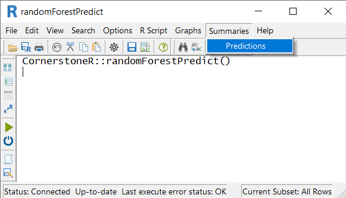
```

This menu opens a dataset with all response columns that are predictable from the chosen random
forest models.

Finally, the 'Cornerstone' workmap with all generated objects looks like the following screenshot.

```{r randomForestPredWorkmap, echo=FALSE, fig.cap="Random Forest: Final Workmap"}
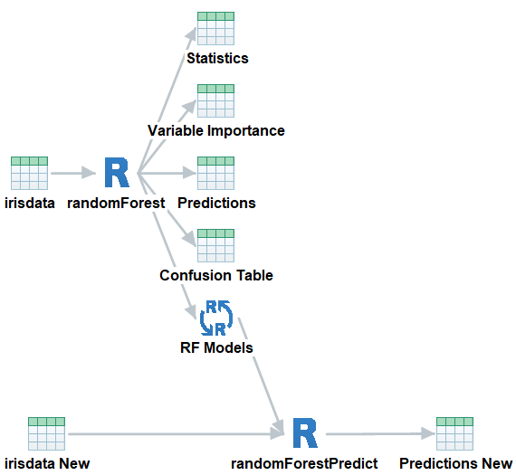
```


# Options in the Script Variables Dialog

Some options are exported from the used 'R' method to 'Cornerstone'. Starting from the 'R' analysis
object 'randomForest' you find the 'Script Variables' dialog via the menu 'R Script' -> 'Script
Variables'. The following dialog appears.

```{r randomForestScriptVars, echo=FALSE, fig.cap="Random Forest: Script Variables"}
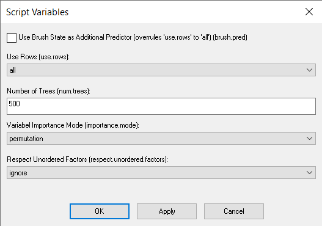
```


## Use Brush as Additional Predictor

During the data exploration phase you probably realize a pattern and want to check its impact on
your responses. By checking 'Use Brush State as Additional Predictor' the current brush selection
is used in the random forest fitting as an additional dichotomous prediction variable. After
brushing observations in a graph or dataset execute the random forest 'R' script and the model is
updated using the brush as predictor variable.


## Only Use Brushed / Non-brushed Rows for Fitting

As an alternative you can use only brushed or non-brushed observations to fit the random forest
model. Hence, after brushing a number of observations it is not necessary to create a 'Cornerstone'
subset to exclude or include specific rows, you can just use this option to fit the random forest
model on the brushed or non-brushed set of rows.

If you use the option above, this selection is automatically overwritten by the setting 'all' rows.


## Miscellaneous Random Forest Options

Setting 'Number of Trees' to a different value changes the number of trees used to fit the random
forest model.

The option 'Variable Importance Mode' can be changed between 'permutation', 'impurity', and
'impurity_corrected'. The measure is the Gini index for classification and the variance of the
response for regression.

Handling of unordered predictors with the option to choose between 'ignore', 'order', and
'partition'. For 'ignore' all factors are regarded ordered, for 'partition' all possible 
2-partitions are considered for splitting. For 'order' and 2-class classification the predictor
levels are ordered by their proportion falling in the second class, for regression by their mean
response. For multi-class classification the predictor levels are ordered by the first principal
component of the weighted covariance matrix of the contingency table. For details take a look into
the documentation of \code{\link[ranger]{ranger}}.
