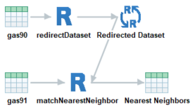
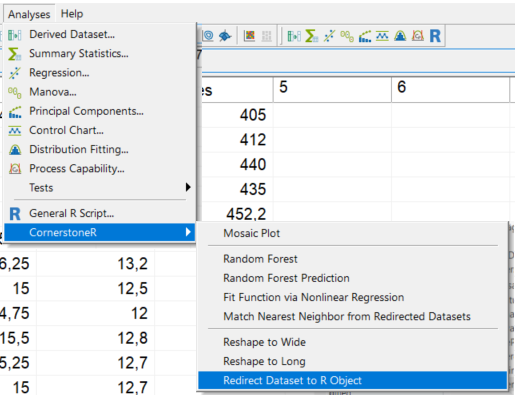
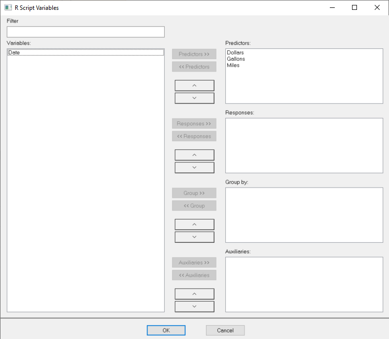
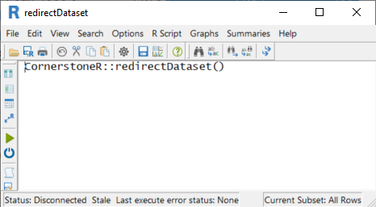
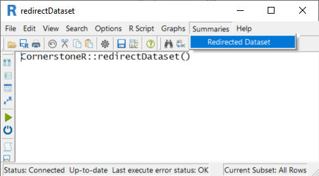
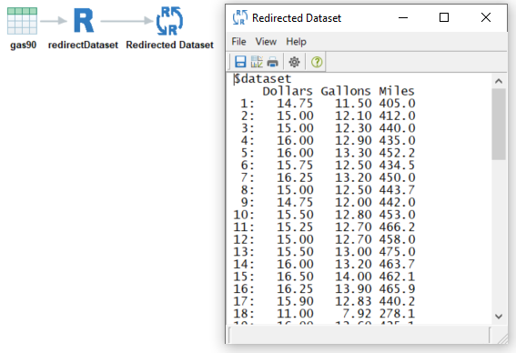
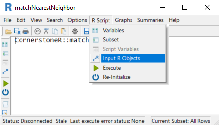
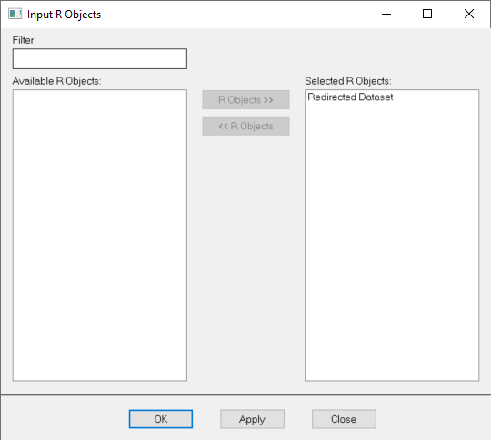

```{r setup, include = FALSE}
# show grouped code output instead of single lines
# use '#>' for R outputs
knitr::opts_chunk$set(collapse = TRUE, comment = "#>")
```


# Initial Situation and Goal

Input datasets are available in Cornerstone and you can select variables in this dataset for each
analysis, e.g., the R interface. R functions can be defined with more than one input dataset. This
function redirects a Cornerstone dataset into an R object which can be used as an 'Input R Object'
in the R interface as shown in the following screenshot.

```{r redirDataOverall, echo=FALSE, fig.cap="Redirect Dataset to R Object: Overview"}

```


# Cornerstone Workflow

As in the screenshot above, we will use the sample dataset 'gas90' for this explanation.

To achieve the result in 'Cornerstone' open a dataset and choose menu 'Analysis' ->
'CornerstoneR' -> 'Redirect Dataset to R Object' as shown in the following screenshot.

```{r redirDataMenu, echo=FALSE, fig.cap="Redirect Dataset to R Object: Menu"}

```

In the appearing dialog select variable all interesting variables to predictors. It is possible to
assign variables to responses, group, and auxiliaries. This information is piped to the redirected
dataset and can be used in other functions.

```{r redirDataVariables, echo=FALSE, fig.cap="Redirect Dataset to R Object: Variable Selection"}

```

'OK' confirms your selection and the following window appears.

```{r redirDataRScript, echo=FALSE, fig.cap="Redirect Dataset to R Object: R Script"}

```

Now, click the execute button (green arrow) or choose the menu 'R Script' -> 'Execute' and
all calculations are done via 'R'. Calculations are done if the text at the lower left status
bar contains 'Last execute error state: OK'. Our result is available via the menu 'Summaries'
-> 'Redirected Dataset' as shown in the following screenshot.

```{r redirDataResultMenu, echo=FALSE, fig.cap="Redirect Dataset to R Object: Result Menu"}

```

After clicking this menu a 'Cornerstone' object with the redirected data opens.

```{r redirDataResultDataset, echo=FALSE, fig.cap="Redirect Dataset to R Object: Result 'R' Object"}

```

# Reuse Redirected Dataset

After you create another analysis (in this example we use 'matchNearestNeighbor' from the dataset
'gas91') we can chose the redirected dataset in the 'R' object via 'R Script' -> 'Input R Objects'.

```{r redirDataUseMenu, echo=FALSE, fig.cap="Redirect Dataset to R Object: Menu Input 'R' Objects"}

```

In the appearing dialog select the corresponding object.

```{r redirDataUseObject, echo=FALSE, fig.cap="Redirect Dataset to R Object: Menu Selected 'R' Object"}

```

'OK' confirms your selection and you get back to the 'R Script' window.

Now, click the execute button (green arrow) or choose the menu 'R Script' -> 'Execute' and
all calculations are done via 'R' within 'matchNearestNeighbor'. If you selected the same
variables as predictors as in the redirected dataset, can get the results from this calculation
via 'Summaries' -> 'Nearest Neighbors'. This dataset shows for each row in 'gas91' the
corresponding row from 'gas90' with the lowest Euclidean distance. You find a detailed explanation
in the corresponding vignette.
