```{r setup, include = FALSE}
# show grouped code output instead of single lines
# use '#>' for R outputs
knitr::opts_chunk$set(collapse = TRUE, comment = "#>")
```


# Reshape Grouped Data to Wide

## Initial Situation and Goal

Reshape grouped data to wide format works on tables in a long format with at least one predictor
column, one response column, and one grouping column. An example is the 'Indometh' dataset with
its first six rows shown in the following table.

```{r Indometh, echo=FALSE, results='asis'}
knitr::kable(head(Indometh), caption = "First six Rows of Indometh Dataset")
```

Our target is to reshape this table into a dataset with a row for each 'Subject' and columns for
every 'time' entity. The data from the column 'conc' should be available as data. Hence, the
result should look like the following table (first 5 columns).

```{r Indometh wide, echo=FALSE, results='asis'}
Indometh.wide = CornerstoneR::reshapeWide(Indometh, "time", "conc", "Subject", character(0)
                                          , list(drop = TRUE, aggr.fun = "mean"), return.results = TRUE
                                          )
knitr::kable(Indometh.wide$reshapeWide[, 1:5], caption = "Indometh Dataset in Wide Format")
```

## Cornerstone Workflow

To achieve this result in 'Cornerstone' open a dataset and choose menu 'Analysis' ->
'CornerstoneR' -> 'Reshape to Wide' as shown in the following screenshot.

```{r reshapeWideMenu, echo=FALSE, fig.cap="Reshape to Wide: Menu"}
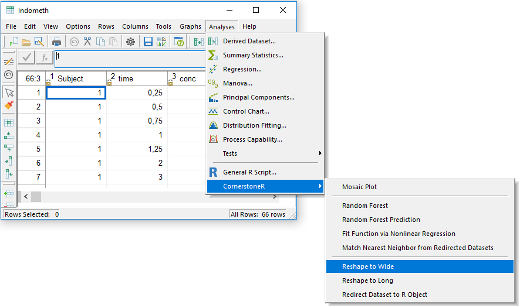
```

In the appearing dialog select variable 'time' to predictors. The unique values are shown in a new
column. The response variable is 'conc'. We want the data allocated in multiple columns with 
respect to the grouping variable 'Subject' because the response is available for every group.

```{r reshapeWideVariables, echo=FALSE, fig.cap="Reshape to Wide: Variable Selection"}
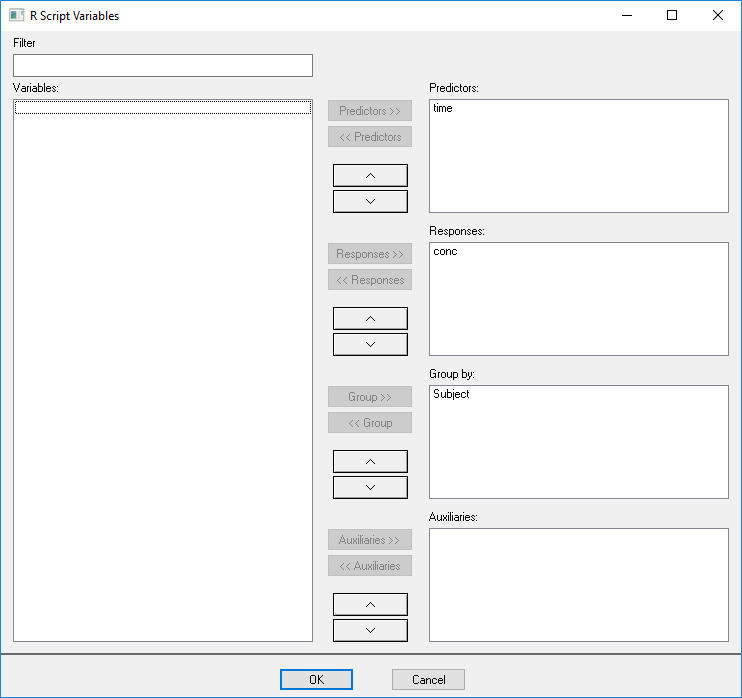
```

'OK' confirms your selection and the following window appears.

```{r reshapeWideRScript, echo=FALSE, fig.cap="Reshape to Wide: R Script"}
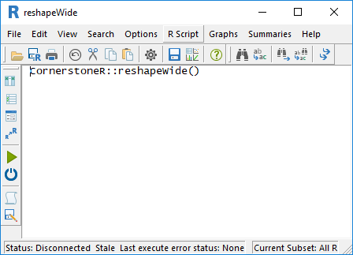
```

Now, click the execute button (green arrow) or choose the menu 'R Script' -> 'Execute' and
all calculations are done via 'R'. Calculations are done if the text at the lower left status
bar contains 'Last execute error state: OK'. Our result is available via the menu 'Summaries'
-> 'Wide Data' as shown in the following screenshot.

```{r reshapeWideResultMenu, echo=FALSE, fig.cap="Reshape to Wide: Result Menu"}
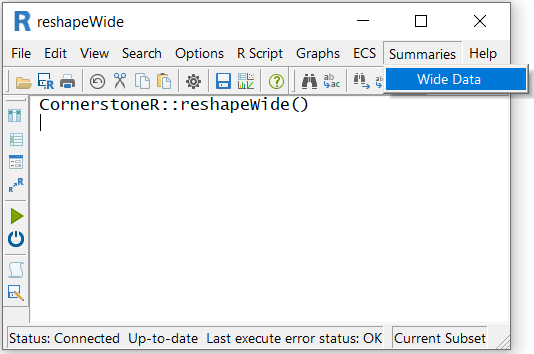
```

After clicking this menu a 'Cornerstone' dataset with the reshaped data opens.

```{r reshapeWideResultDataset, echo=FALSE, fig.cap="Reshape to Wide: Result Dataset"}
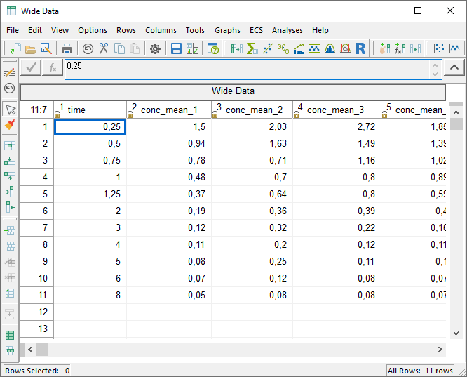
```

## Parametrization in Script Variables

Reshape to Wide can be parametrized by the 'Script Variables' dialog via the menu 'R Script' ->
'Script variables'. The following dialog appears.

```{r reshapeWideScriptVariables, echo=FALSE, fig.cap="Reshape to Wide: Script Variables"}
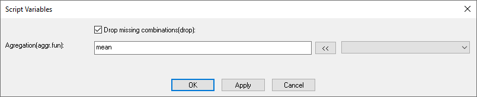
```

### 'Drop missing combinations'
This checkbox allows the algorithm to drops rows with solely missing values.
The default is checked.

### 'Aggregation'
The text box can hold a comma separated list of aggregation function.
The default is 'mean'.
If you select variables as 'Auxiliaries' in the variable selection menu they are shown in the
drop-down box right from the '<<' button.

Let's take a look at the following dataset example:

```{r reshapeWideAggregation, echo=FALSE, results='asis'}
Indometh.man = data.frame(Subject = rep(1, 6)
                          , time = rep(c(0.25, 0.5), each = 3)
                          , conc = c(1.5, 1.67, 1.58, 0.94, 0.89, 0.72)
                          , repet = rep(c(1, 2, 3), 2)
                          )
knitr::kable(Indometh.man, caption = "Example Dataset with Repetitions")
```

The aggregation function is used if one response data is not identifiable by the combination of 
predictors and groups. In case Subject 1 for time 0.25 was measured three times. We obtain the 
following result using the aggregation function 'mean' and 'sd'

```{r IndomethAggrMean, echo=FALSE, results='asis'}
Indometh.man.wide = CornerstoneR::reshapeWide(Indometh.man[, 1:3], "time", "conc", "Subject", character(0)
                                          , list(drop = TRUE, aggr.fun = "mean, sd"), return.results = TRUE
                                          )
knitr::kable(Indometh.man.wide$reshapeWide, caption = "Example Dataset in Wide Format")
```

As you can see new columns are added for each additional aggregation function, in this example
'mean, sd'.

How is an auxiliary variable used in this case? In case of repeated measurements it can bee 
necessary to select the last or first repetition.

From the example above we would like to get the data for the highest repetition value and add
'maxby(repet)' to the aggregation function. As opposed to this 'minby(repet)' returns the 'conc'
value for the lowest repetition value. The following table shows the corresponding results applying
both functions.

```{r Indometh manual wide, echo=FALSE, results='asis'}
Indometh.man.wide = CornerstoneR::reshapeWide(Indometh.man, "time", "conc", "Subject", "repet"
                                          , list(drop = TRUE, aggr.fun = "maxby(repet), minby(repet)")
                                          , return.results = TRUE
                                          )
knitr::kable(Indometh.man.wide$reshapeWide, caption = "Example Dataset in Wide Format")
```


# Reshape Grouped Data to Long

## Initial Situation and Goal

Reshape grouped data to long format works on tables in wide format with at least one predictor and
one response column. An example is shown in the following table.

```{r reshapeLongSample1, echo=FALSE, results='asis'}
knitr::kable(data.frame(Place = c("Europe", "USA", "Asia")
                        , Temp.Jan = c(0, -10, 20)
                        , Temp.July = c(20, 15, 50)
                        ))
```

Our target is to reshape this dataset into a dataset with the temperatures 'Temp.Jan' and
'Temp.July' as responses in one column and an additional column to identify the month. All 
predictors records should be multiplied like shown in the following table to identify each
data correctly.

```{r reshapeLongSample2, echo=FALSE, results='asis'}
knitr::kable(data.frame(Place = rep(c("Europe", "USA", "Asia"), 2)
                        , variable = rep(c("Jan", "July"), each = 3)
                        , value = c(0, -10, 20, 20, 15, 50)
                        ))
```

The predictor 'time' is available in one column because it belongs to all responses. Selected
responses are split to multiple columns depending on the value in grouping column.


## Cornerstone Workflow

To achieve this result in 'Cornerstone' open a corresponding dataset, e.g. sample dataset 'cities',
and choose menu 'Analysis' -> 'CornerstoneR' -> 'Reshape to Long' as shown in the following
screenshot.

```{r reshapeLongMenu, echo=FALSE, fig.cap="Reshape to Long: Menu"}
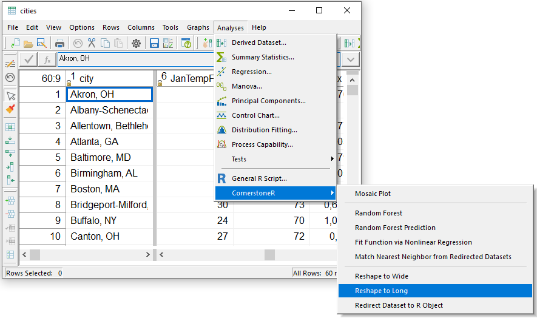
```

In the appearing dialog select 'city' as a predictor and both temperatures 'JanTempF' and
'JulyTempF' as responses. We want to stack all temperatures with respect to each city.

```{r reshapeLongVariables, echo=FALSE, fig.cap="Reshape to Long: Variable Selection"}
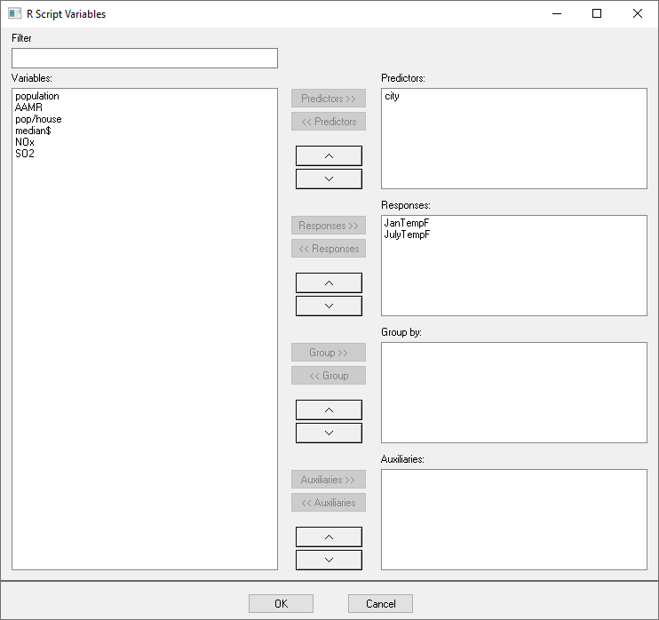
```

'OK' confirms your selection and the following window appears.

```{r reshapeLongRScript, echo=FALSE, fig.cap="Reshape to Long: R Script"}
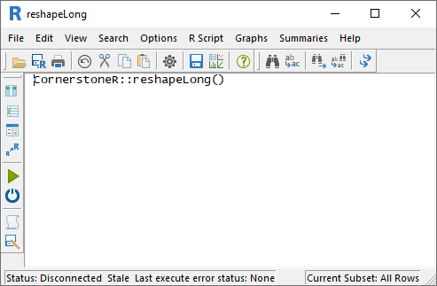
```

Before we start to reshape our data, it is necessary to check the string by which each response
variable name is split. Choose menu 'Options' -> 'Script Variables' as shown in the following
screenshot.

```{r reshapeLongRScriptVarsMenu, echo=FALSE, fig.cap="Reshape to Long: R Script Variables Menu"}
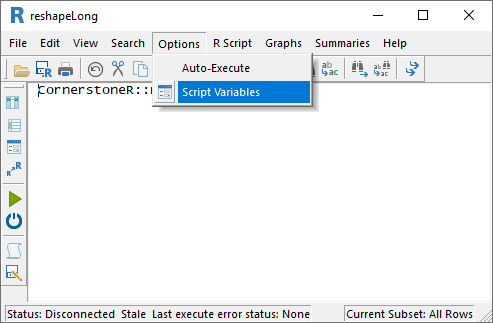
```

The appearing dialog shows by default an underscore ('_'). We want to split the variable name at
the word 'Temp' because it is redundant and change the text box to 'Temp' as shown in the next
screenshot.

```{r reshapeLongRScriptVars, echo=FALSE, fig.cap="Reshape to Long: R Script Variables"}
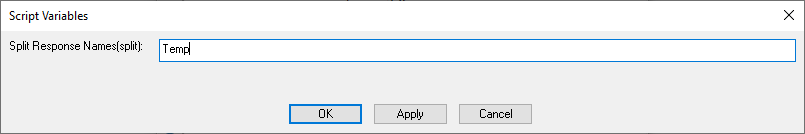
```

If you don't want to split the variable name at all remove all characters from the split text box.
'OK' confirms settings to the script variables.

Now, click the execute button (green arrow) or
choose the corresponding menu 'R Script' -> 'Execute' and all calculations are done via 'R'.
The text in the lower left status bar turns to 'Last execute error state: OK' to identify a
successful termination. Our result is available via menu 'Summaries' -> 'Long Data' as shown
in the following screenshot.

```{r reshapeLongResultMenu, echo=FALSE, fig.cap="Reshape to Long: Result Menu"}
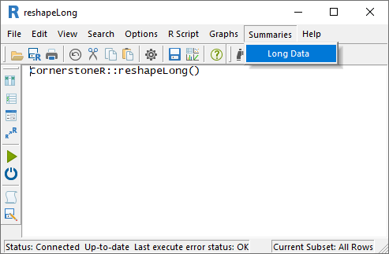
```

After clicking a 'Cornerstone' dataset with the reshaped data opens.

```{r reshapeLongResultDataset, echo=FALSE, fig.cap="Reshape to Long: Result Dataset"}
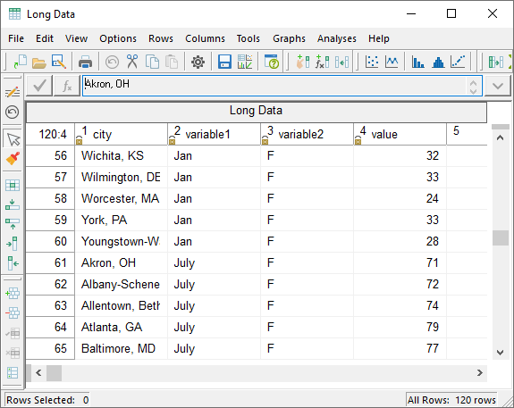
```

Selected predictors are multiplied in their column. All response names are split by 'Temp' and
available in two new columns 'variable1' and 'variable2'. The corresponding value is stored in 
column 'value'.

# Transpose Data

## Initial Situation and Goal

If data are available in rows, it is necessary to transpose the data set before further evaluation.
An example is 'Summary Statistic' table from Cornerstone without groups as shown in the following
table.

```{r reshapeTransposeSample, echo=FALSE, results='asis'}
knitr::kable(data.frame(Statistic = c("Count", "Mean", "St. Dev.")
                        , MPG = c(398, 23.52, 7.82)
                        , Displacement = c(406, 194.78, 104.92)
                        , Horsepower = c(400, 105.08, 38.77)
                        , Weight = c(406, 2979.41, 847.00)
                        , Acceleration = c(406, 15.52, 2.80)
                        ))
```

To use these data in further analysis or graphs, it is necessary to transpose the data so that
they are available as shown in the following table.

```{r reshapeTransposeResult, echo=FALSE, results='asis'}
knitr::kable(data.frame(colnames = c("MPG", "Displacement", "Horsepower", "Weight", "Acceleration")
                        , Count = c(398, 406, 400, 406, 406)
                        , Mean = c(23.52, 194.78, 105.08, 2979.41, 15.52)
                        , StDev = c(7.82, 104.92, 38.77, 847.00, 2.80)
                        ))
```

## Cornerstone Workflow

To achieve this result in 'Cornerstone', select the 'Analysis' -> 'CornerstoneR' ->
'Transpose Data' menu from the corresponding record, as shown in the following screenshot.

```{r reshapeTransposeMenu, echo=FALSE, fig.cap="Transpose Data: Menu"}
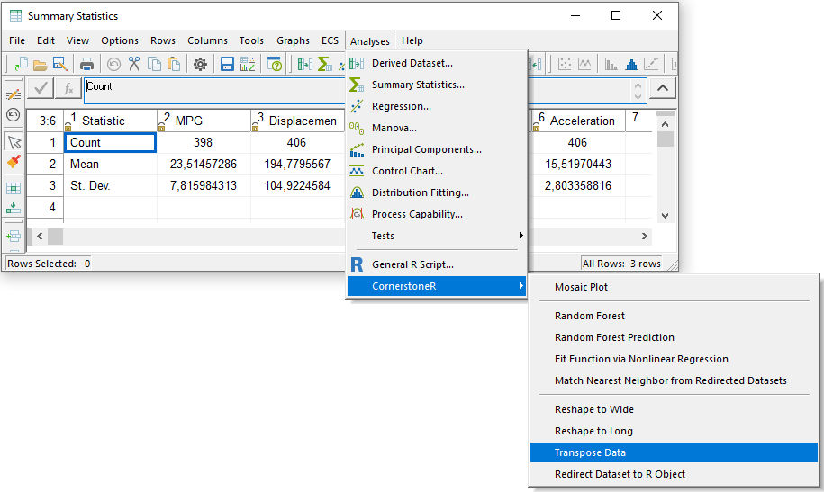
```

In the appearing dialog select the variables 'MPG' to 'Acceleration' as predictors or responses.
For this function the division is irrelevant, because all selected variables are transposed.
The variable 'Statistics' contains names for the future columns and is optionally selected as
'Group by'.

```{r reshapeTransposeVariableSeleciton, echo=FALSE, fig.cap="Transpose Data: Variable Selection"}
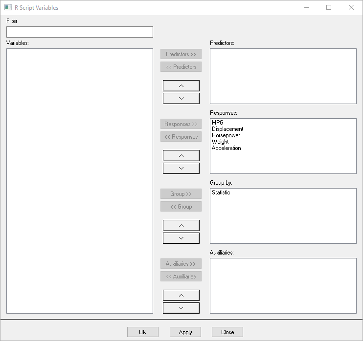
```

'OK' confirms your selection and the following window appears.

```{r reshapeTransposeRScript, echo=FALSE, fig.cap="Transpose Data: R Script"}
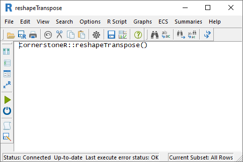
```

Now click the green button (green arrow) or select the menu 'R Script' -> 'Execute' to have all
calculations performed by 'R'. The execution was successful, if the status bar in the lower left
corner shows the text 'Last execute error state: OK'. Our result is available via the menu
'Summaries' -> 'Transposed Data' as shown in the following screenshot.

```{r reshapeTransposeResultMenu, echo=FALSE, fig.cap="Transpose Data: Result Menu"}
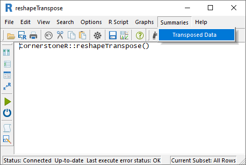
```

After clicking this menu, the dataset with the transposed data opens.

```{r reshapeTransposeResultDataset, echo=FALSE, fig.cap="Transpose Data: Result Dataset"}
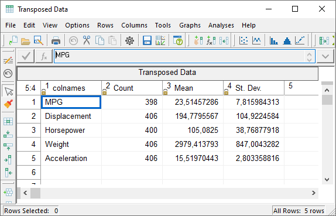
```

## Parametrization in Script Variables

The 'Transpose Data' function converts all data into numeric values. If the conversion is not
successful, missing values are inserted. This conversion can be deactivated with the
'Script Variables' dialog via the 'R Script' -> 'Script Variables' menu. The following dialog
appears.

```{r reshapeTransposeScriptVariables, echo=FALSE, fig.cap="Transpose Data: Script Variables"}
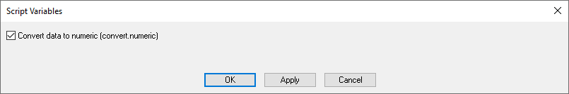
```

If you uncheck 'Convert data to numeric', for example, text is retained and is not replaced by a
missing value.
